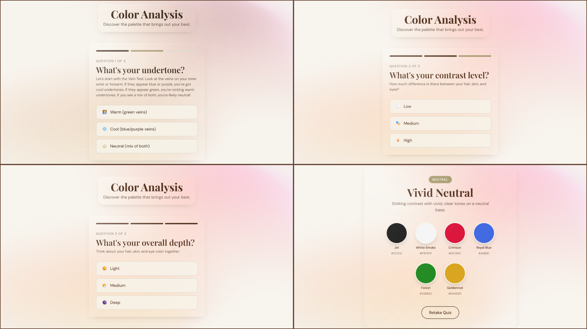

# 🎨 Color Analysis Tool

This Color Analysis Tool is a simple web app the helps users discover a color palette based on their undertone(s), contrast, and depth.



## Features
- Answer 3 quick questions (undertone, contrast, depth)
- Get a suggested color palette
- View colors as swatches with hex codes
- Option to retake the quiz

## Built with...
- React
- Vite
- Tailwind CSS

## Run the project
```bash
npm install
npm run dev
```

Developed by Richelle Adarlo <3